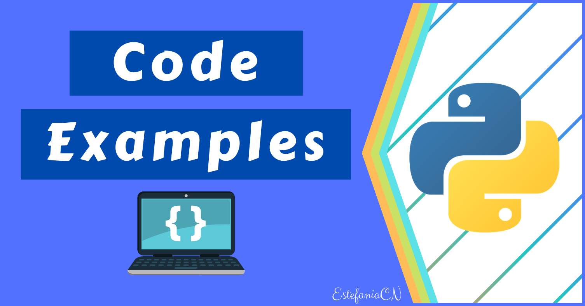

# Program Examples – Simple Code Examples for Beginners

Simple code examples are a great way for beginners to get their feet wet and learn the basics of programming. In this article, I will provide a series of simple code examples that are perfect for Python beginners.
These examples cover a range of programming concepts and will help you develop a solid foundation in programming. Whether you're new to programming or just looking to brush up on your skills, these code examples will help you get started on your coding journey.

## Build a Number Guessing Game in Python
### In this project, you will create a simple number guessing game that allows the user to guess a random number between 1 and 100. The program will give hints to the user after each guess, indicating whether their guess was too high or too low, until the user guesses the correct number.
[python code](Number_Guessing_Game.py) 

## Build a Simple Password Generator in Python
### A password generator, as the name implies, generates a random password of a particular length using different combination of characters, and special characters.
[python code](Simple_Password_Generator.py) 

## Build a Password Checker in Python
### We will build a password checker in this section. Its job is to check if a password is strong enough based on some of the criteria we set. It'll print an error if any of the password criteria isn't met.
[python code](Password_Checker.py) 

## Build a Web Scraper in Python
### A web scraper scrapes/gets data from webpages and saves it in any format we want, either .csv or .txt. We will build a simple web scraper in this section using a Python library called Beautiful Soup.
[python code](Web_Scraper_Python.py) 

## Build a Currency Converter in Python
### A currency converter is a program that helps users convert the value of one currency into another currency. You can use it for a variety of purposes, such as calculating the cost of international purchases, estimating travel expenses, or analyzing financial data.
#### Note: we will use the ExchangeRate-API to get the exchange rate data, which is a free and open-source API for currency exchange rates. But there are other APIs available that may have different usage limits or requirements.
[python code](Currency_Converter.py) 
